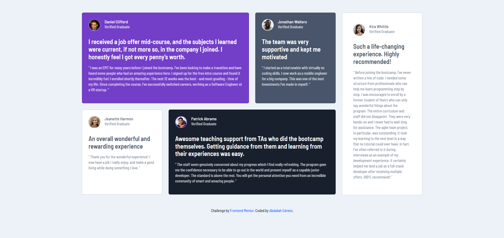

# Frontend Mentor - Testimonials grid section solution

This is a solution to the [Testimonials grid section challenge on Frontend Mentor](https://www.frontendmentor.io/challenges/testimonials-grid-section-Nnw6J7Un7).

## Table of contents

- [Overview](#overview)
  - [The challenge](#the-challenge)
  - [Screenshot](#screenshot)
  - [Links](#links)
- [My process](#my-process)
  - [Built with](#built-with)
- [Author](#author)

## Overview

### The challenge

Users should be able to:

- View the optimal layout for the site depending on their device's screen size

### Screenshot

### Links

- Solution URL: (https://github.com/abdallahedreeso/3-column-preview-card-component)
- Live Site URL: (https://3-column-preview-card-component-pearl-pi.vercel.app/)

## My process

### Built with

- Semantic HTML5 markup
- CSS custom properties
- Bootstrap
- Mobile-first workflow

## Author

- LinkedIn - [AbdallahEdrees] (https://www.linkedin.com/in/abdallah-edrees/)
- Frontend Mentor - [@abdallahedreeso](https://www.frontendmentor.io/profile/abdallahedreeso)
